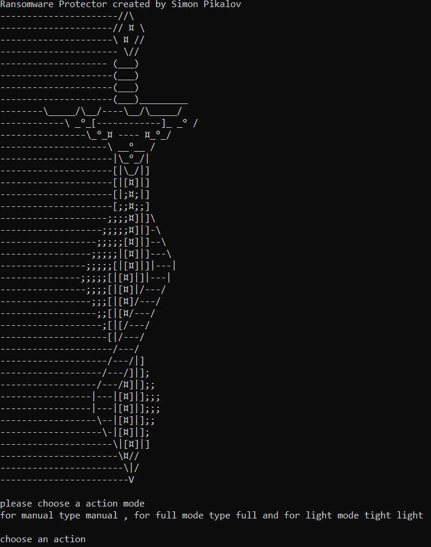
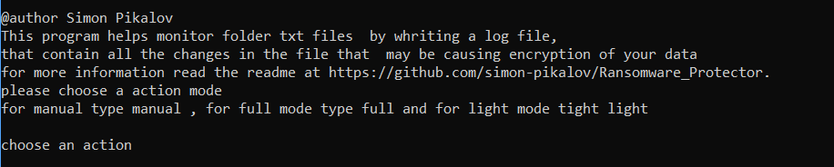
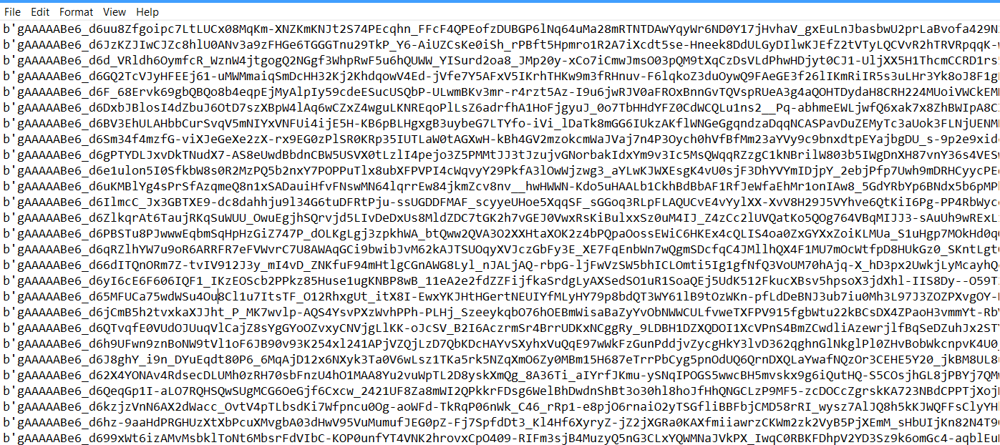
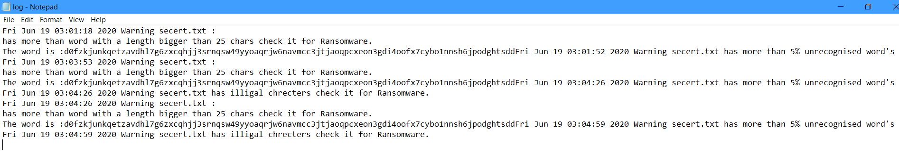

# Ransomware Protector
This  project represents a Program for cross-platform Ransomware monitor for Windows and Linux 
The program is designed to help notice a problems in a txt file in the current folder where the program being lunched.
The program have two modes of doing that Full that will check in a big worlist and will take more time and resources from your pc 
and Light mode in witch will be more fast but less accurate  .  
  
 
 # Main features : 
  
  - Command line  Based User interface with interactive control's
  - Only files that have been recently modified will be checked to save system resources.
  - write a all the service running to a log file in a user defind time stamp. 
  - Full mode of comparing the txt to a huge worlist file. 
  - Light  mode with simple check of the file.
 

  
### Installation
To Run the Program you must import watchdog wich is not in the Python standart lib


Pull the file from the Git repository with the command : 
```sh
https://github.com/simon-pikalov/Ransomware_Protector.git

```
 
Then 
to install the requirements run the command 
```sh
$ pip install -r requirements.txt

```


# The Program


### help menu  : 
Type help


## Ransomware file (after atack)  : 



### Program  Output : 
This is the Output of the full Mode  . 


### Log file (same as output): 



   


